# Attention Rollout for Recurrent Vision Transformers

<p align="center">
  <strong>Tracing attention through both Transformer layers and recurrent inference steps in RecViT.</strong>
</p>

<p align="center">
  
  
  <a href="LICENSE"></a>
  
</p>

Standard Attention Rollout follows information flow across the layers of a feed-forward Vision Transformer. **RecViT adds recurrence:** an image is processed repeatedly while the class token is propagated between steps. A rollout confined to one pass therefore cannot describe the complete recurrent inference process.

This project extends Attention Rollout with **recurrent transition matrices**, allowing attention to be aggregated across both Transformer layers and RecViT steps. It also provides per-step visualizations and a trimap-based evaluation pipeline for measuring foreground/background alignment on the Oxford-IIIT Pet dataset.

## Visual overview

### Strong localization, even with a wrong prediction

<table>
  <tr>
    <th>Input</th>
    <th>Final recurrent rollout</th>
    <th>Rollout + trimap boundary</th>
  </tr>
  <tr>
    <td></td>
    <td>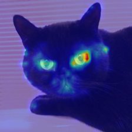</td>
    <td>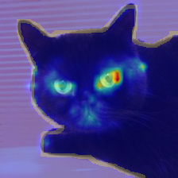</td>
  </tr>
</table>

The rollout is strongly concentrated on the cat, especially its face and eyes (**attention score: 0.600**). The final prediction is **Sphynx**, however, rather than Bombay. This is a useful reminder that good spatial localization does not guarantee correct fine-grained classification.

## Key results

The final thesis experiments evaluated **432 completed configurations** on a reduced Oxford-IIIT Pet subset. The grid covered 2-4 recurrent loops, three attention-head fusion methods, three discard ratios, and two patch-transition strategies.

| Comparison | Fixed raw final-layer attention | Last-step local rollout | Final recurrent rollout |
|---|---:|---:|---:|
| Mean score across the full matched grid | -0.266 | -0.093 | **-0.011** |

- Final recurrent rollout scored higher than the fixed raw map in **263/432 cases (60.9%)**.
- It scored higher than last-step local rollout in **358/432 cases (82.9%)**.
- In the main configuration (`3 loops`, `mean` fusion, `discard_ratio=0.9`), the mean score improved from **-0.699** for the fixed raw reference to **0.295** with `identity` and **0.359** with `zero`.

The metric measures spatial agreement with PET foreground and background regions. These results support recurrent rollout as a useful diagnostic aggregation method, **not as a causal explanation** of the model's decision.

## Why recurrent rollout is needed

| Standard Attention Rollout | This project |
|---|---|
| Assumes one feed-forward Transformer pass | Models multiple recurrent RecViT steps |
| Composes attention across layers | Composes attention across layers **and recurrent transitions** |
| Produces a rollout for one model pass | Produces a final rollout and final-to-step-input diagnostic maps |
| Has no rule for cross-step token dependencies | Explicitly represents propagated CLS-token information |

## Method

At every recurrent step, the implementation captures the attention matrices from all Transformer layers and computes a local rollout. It then connects consecutive steps through transition matrices derived from RecViT's propagated class token.

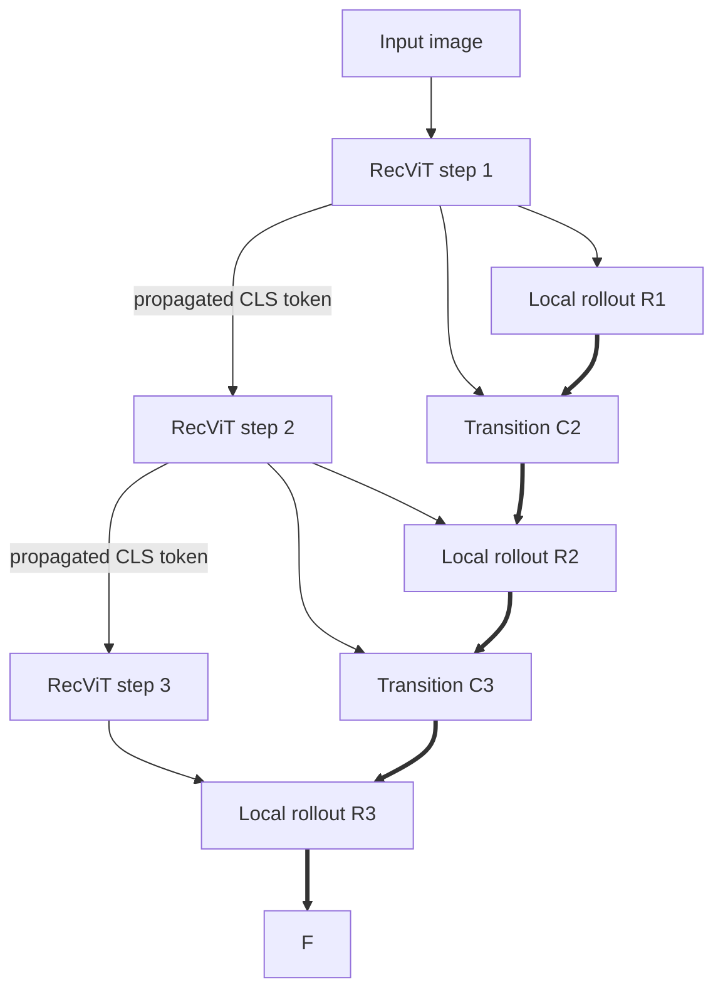

For recurrent step \(t\), residual-aware layer attentions are composed into a local rollout matrix:

$$R_t = \widetilde{A}_{t,L}\widetilde{A}_{t,L-1}\cdots\widetilde{A}_{t,1}.$$

Starting from the last step, the method moves backward through recurrent transitions:

$$F_T = R_T, \qquad F_{t-1} = F_t C_t.$$

The first row of each transition matrix represents the propagated CLS-token dependency. Because RecViT does not propagate patch tokens in the same explicit way, the implementation evaluates two assumptions:

- **`identity`** - corresponding patch tokens are connected across recurrent steps.
- **`zero`** - patch-token rows are treated as new independent inputs; only the CLS dependency is propagated.

Neither strategy is claimed to be universally correct. They are explicit modeling assumptions whose behavior is compared experimentally.

## Recurrent evolution

The Chihuahua example illustrates how foreground alignment changes in the final-to-step-input maps.

<table>
  <tr>
    <th>Input</th>
    <th>Final to input step 1</th>
    <th>Final to input step 2</th>
    <th>Final to input step 3</th>
  </tr>
  <tr>
    <td>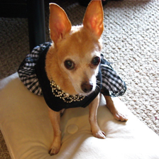</td>
    <td>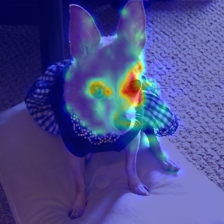</td>
    <td>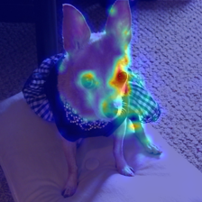</td>
    <td>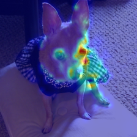</td>
  </tr>
</table>

Foreground alignment rises from **-0.007 to 0.080 to 0.168**. The final prediction is **Sphynx** (incorrect), showing that recurrent aggregation can improve localization without correcting the model's classification.

## Additional qualitative examples

### Successful explanation

<table>
  <tr>
    <th>Input</th>
    <th>Final recurrent rollout</th>
    <th>Rollout + trimap boundary</th>
  </tr>
  <tr>
    <td></td>
    <td>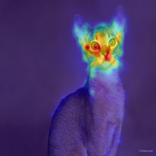</td>
    <td>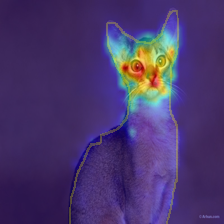</td>
  </tr>
</table>

The rollout highlights the cat's distinctive facial features (**score: 0.461**) and the final prediction is **Abyssinian** (correct).

### Failure case

<table>
  <tr>
    <th>Input</th>
    <th>Final recurrent rollout</th>
    <th>Rollout + trimap boundary</th>
  </tr>
  <tr>
    <td>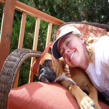</td>
    <td>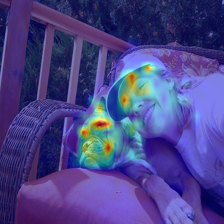</td>
    <td></td>
  </tr>
</table>

The nearby person competes with the dog for attention, producing poor foreground localization (**score: -0.280**) despite the correct **Boxer** prediction. This is the clearest failure case in the selected examples.

## Evaluation metric

PET trimaps are converted into a score mask:

| Region | Value |
|---|---:|
| Animal foreground | +1 |
| Boundary | 0 |
| Background | -1 |

For normalized attention map \(A\) and score mask \(S\):

$$\operatorname{score}(A,S)=\frac{\sum_i A_iS_i}{\sum_i A_i}.$$

Scores lie between -1 and +1. A higher score means that more attention mass falls on the annotated animal foreground and less on the background. The neutral boundary reduces sensitivity to small segmentation-edge differences.

## Installation

Clone the repository and create an isolated environment:

```bash
git clone https://github.com/m-shaforostov/rec-vit-attention-rollout.git
cd rec-vit-attention-rollout

python -m venv .venv
source .venv/bin/activate  # Windows: .venv\Scripts\activate
python -m pip install --upgrade pip
pip install torch torchvision numpy opencv-python Pillow
```

> A dependency file will replace the explicit installation command once the environment has been validated and version ranges have been recorded.

### Checkpoint setup

The reference PET experiment uses a pretrained tiny RecViT checkpoint with three recurrent loops. The current loader expects the file:

```text
<NETWORKS_DIR>/PET/pet_tiny_pretrained_k_3_run_0.pth
```

`NETWORKS_DIR` is defined by the bundled RecViT model configuration. Model weights are not committed to this repository. A compatible checkpoint must therefore be obtained separately and placed at the path above before running the example.

## Reference run

The following command reproduces the configuration used by the featured Abyssinian example when supplied with the corresponding image, trimap, and checkpoint:

```bash
python rec_vit_explain.py \
  --image_path path/to/Abyssinian_24.jpg \
  --trimap_path path/to/Abyssinian_24_trimap.png \
  --output_dir rollout_results/Abyssinian_24 \
  --dataset PET \
  --model_name tiny \
  --tiny_patch 8 \
  --n_loops 3 \
  --run_no 0 \
  --pretrained \
  --head_fusion mean \
  --discard_ratio 0.9 \
  --patch_attendance identity
```

Main outputs:

```text
rollout_results/Abyssinian_24/
├── input.png
├── rec_rollout_3_loops_identity_0.900_mean.png
├── rec_rollout_final_to_input_step_1_3_loops_identity_0.900_mean.png
├── rec_rollout_final_to_input_step_2_3_loops_identity_0.900_mean.png
├── rec_rollout_final_to_input_step_3_3_loops_identity_0.900_mean.png
└── trimap/
    ├── attention_scores.csv
    ├── generated_trimap_color.png
    └── final_rollout_attention_trimap_overlay.png
```

Use `--use_cuda` to enable CUDA when a compatible NVIDIA GPU and PyTorch installation are available.

## Main capabilities

- Extracts multi-head self-attention from each Transformer layer and recurrent step.
- Supports `mean`, `max`, and `min` attention-head fusion.
- Supports configurable low-attention discard ratios.
- Computes a local Attention Rollout matrix for every recurrent step.
- Composes recurrent transitions with `identity` or `zero` patch assumptions.
- Generates final and final-to-step-input attention heatmaps.
- Produces PET trimap overlays and quantitative localization scores.
- Provides command-line experiment controls and batch experiment tooling.

## Project origin

This project began as the practical component of my Bachelor's thesis at Comenius University. I wanted to explore a challenging topic in modern machine learning, and Vision Transformers caught my attention because of their growing importance in computer vision. During my research, I found that existing Attention Rollout methods were designed for standard feed-forward Vision Transformers and could not directly represent RecViT's multi-step recurrent inference.

That gap became the central challenge of the thesis. I designed and implemented an extension that propagates attention across both Transformer layers and recurrent steps, making it possible to inspect how attention-based relevance is aggregated during recurrent inference. I also built the visualization, evaluation, and experiment pipeline used to compare attention maps against Oxford-IIIT Pet trimaps.

The project deepened my understanding of deep learning, Transformer architectures, explainable AI, experimental design, and the process of turning a research idea into working software.

## My contribution

### Designed and implemented

- Analyzed why standard Attention Rollout cannot be applied directly across RecViT recurrence.
- Designed recurrent rollout composition using custom transition matrices between steps.
- Implemented the explainability pipeline in PyTorch.
- Added per-step, final rollout, heatmap, and trimap-overlay visualizations.
- Designed and implemented the PET trimap evaluation pipeline and localization metric.
- Built command-line tooling and automated experiments covering hundreds of configurations.
- Conducted the experiments, analyzed the results, and documented the findings in the thesis.

### Adapted existing work

- Used an existing implementation of the **Recurrent Vision Transformer (RecViT)** as the model under analysis.
- Adapted the original **Attention Rollout** method, developed for standard Transformers, to RecViT's recurrent architecture.
- Modified the model-inspection pipeline to capture intermediate attention tensors from recurrent inference.

### Out of scope

- I did **not** design the RecViT architecture.
- I did **not** train the RecViT checkpoints from scratch.
- I did **not** develop a new image-classification model.
- The contribution focuses on interpretability, algorithm design, implementation, and experimental evaluation rather than classification accuracy.

## Repository guide

| File | Purpose |
|---|---|
| `rec_vit_rollout.py` | Recurrent rollout algorithm, local rollout, and cross-step transition composition |
| `rec_vit_explain.py` | CLI, preprocessing, model inference, visualization, and output generation |
| `attention_map_evaluation.py` | Trimap conversion and attention localization scoring |
| `reveal_segmentation.py` | Trimap generation and visualization helpers |
| `rec_vit_model/` | Existing RecViT model implementation and checkpoint-loading utilities |

## Limitations

- The final evaluation uses a small, manually selected subset of eight PET images and is not statistically representative of the complete dataset.
- The public pipeline currently uses the same image at every recurrent step; multi-input recurrence is not implemented.
- Cross-step patch-token behavior is not specified directly by RecViT, so `identity` and `zero` are explicit assumptions.
- Results depend on the chosen head fusion, discard ratio, recurrent depth, and patch-transition strategy.
- The trimap score measures spatial foreground/background alignment, not causal importance.
- Raw attention is strongly layer-dependent; some intermediate raw layers can outperform the fixed final-layer reference. Recurrent rollout should be viewed as a systematic aggregation method, not a universal replacement for raw attention maps.

## Future work

- Evaluate on a larger, representative dataset split.
- Compare against additional explainability methods and causal evaluation protocols.
- Study alternative cross-step patch-transition models.
- Add focused unit tests for rollout composition and scoring.
- Publish a validated dependency specification and checkpoint acquisition workflow.
- Build an interactive demo for exploring recurrent-step attention.

## References

1. Pócoš, Š., Bečková, I., & Farkaš, I. (2024). [RecViT: Enhancing Vision Transformer with Top-Down Information Flow](https://www.scitepress.org/Papers/2024/124647/124647.pdf).
2. Abnar, S., & Zuidema, W. (2020). [Quantifying Attention Flow in Transformers](https://aclanthology.org/2020.acl-main.385.pdf).
3. Vaswani, A., et al. (2017). [Attention Is All You Need](https://proceedings.neurips.cc/paper_files/paper/2017/hash/3f5ee243547dee91fbd053c1c4a845aa-Abstract.html).
4. Shaforostov, M. (2026). *Analysis of attention maps generated by recurrent neural network RecViT and comparison with other explainability methods*. Bachelor's thesis, Comenius University in Bratislava.

## Attribution and license

The repository builds on prior RecViT and Attention Rollout work. See the references above and the source-level history for attribution. The included upstream Attention Rollout code is distributed under the MIT License; see [`LICENSE`](LICENSE) for the preserved notice.

---

<p align="center">
  Built by <strong>Maksym Shaforostov</strong> as a research and software-engineering project in explainable computer vision.
</p>
